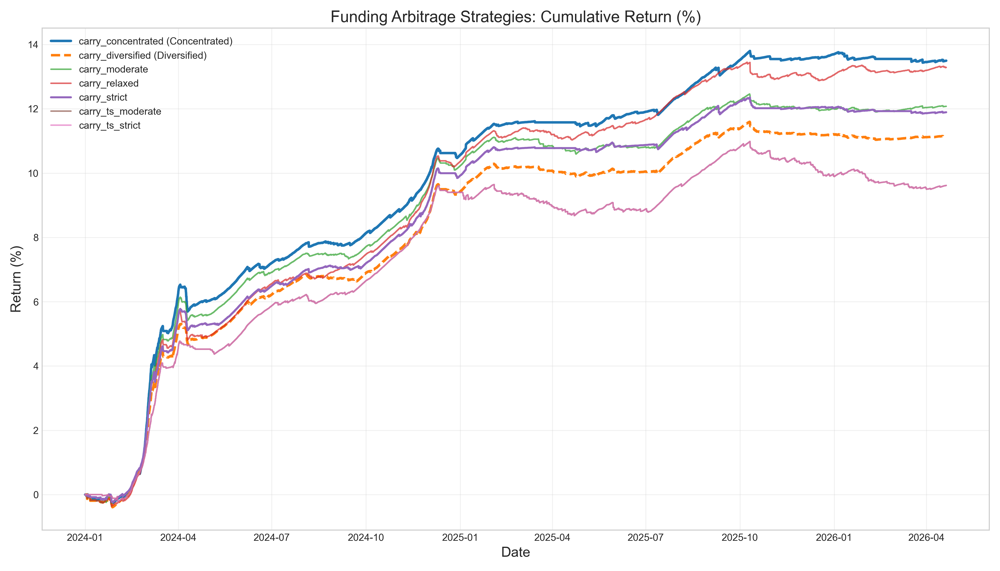
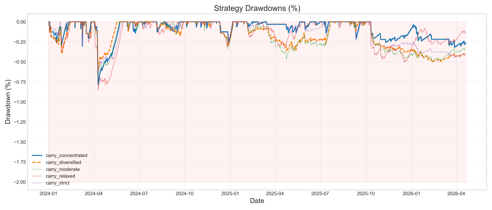
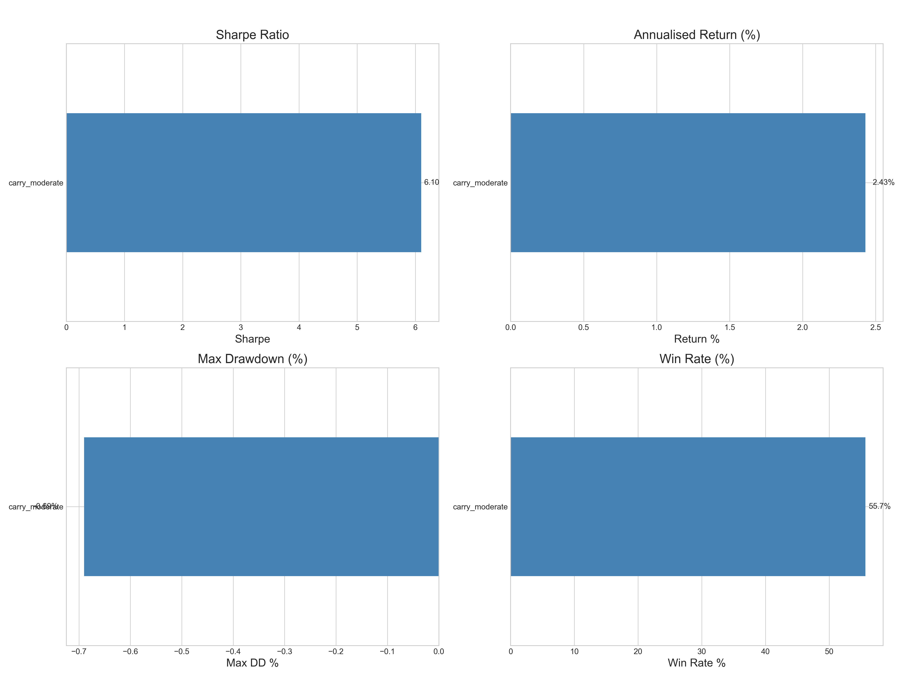

# Funding Rate Arbitrage

[](https://www.python.org/downloads/)
[](https://opensource.org/licenses/MIT)

A delta-neutral cryptocurrency funding rate arbitrage research framework with trackable backtest results. The system collects historical 8-hour funding rate data across perpetual futures on **Binance**, **Bybit**, and **OKX**, then backtests strategies that go long spot and short perpetual to harvest funding payments.

---

## What This Project Does

This framework implements and compares multiple approaches to funding rate arbitrage:

1. **Data Ingestion** — Downloads and caches 8-hour funding rates, OHLCV prices, and open-interest data via `ccxt` and optional CoinAPI.
2. **Signal Generation** — Computes composite signals including funding z-scores, basis momentum, open-interest concentration, and term structure.
3. **Backtest Engine** — Replays historical funding snapshots with realistic fee models, slippage, and risk management.
4. **Strategy Evolution** — Documents the shift from a mean-reversion baseline to a trend-following adaptive carry approach.

### Core Idea

Perpetual futures exchanges use funding rates to anchor perp prices to spot. In crypto, the structural long bias creates persistently positive funding rates. By going **long spot** and **short perpetual**, a trader can collect these funding payments with near-zero directional exposure.

---

## Data Used

The backtest uses the following data sources and characteristics:

| Attribute | Description |
|-----------|-------------|
| **Exchanges** | Binance, Bybit, OKX |
| **Symbols** | 47 perpetual pairs (BTC, ETH, SOL, BNB, XRP, DOGE, and others — see `config/universe.yaml`) |
| **Frequency** | 8-hour funding rate snapshots (3 periods per day) |
| **Date Range** | January 2024 – April 2026 (~2.3 years, ~5,800 periods) |
| **Total Records** | ~133,000 funding rate observations |
| **Additional Data** | Spot and perpetual OHLCV (for basis calculation), open-interest snapshots |

> **Privacy Note:** Raw market data is cached locally in `data/cache/` and is excluded from version control. The repository contains only the backtest logic, configuration, and aggregated results. Users must run the downloaders themselves to populate the local cache.

---


## Strategy Evolution

### Baseline: Z-Score Mean Reversion (Poor Performance)

Our first approach used a rolling z-score on funding rates:
- **Entry:** When z-score > 1.5 and annualised rate > 5%
- **Exit:** When z-score returns to 0
- **Logic:** Bet that extreme funding rates will mean-revert

**Why it failed:**
- Funding rates in crypto exhibit strong **autocorrelation**, not mean reversion. Extreme rates tend to persist rather than immediately reverse.
- The strategy entered on temporary spikes and exited as rates "normalised," often locking in losses.
- During sustained high-funding regimes (common in bull markets), the strategy sat in cash while carry traders collected consistent yield.

**Baseline Results:**

| Metric | Value |
|--------|-------|
| Cumulative Return | **-6.27%** |
| Annual Return | -0.3% |
| Sharpe Ratio | -0.95 |
| Max Drawdown | -10.0% |
| Win Rate | 17.0% |


### Adaptive Carry (Trend-Following)

We shifted the rationale from *mean reversion* to *trend following*:
- **Entry:** When the 7-day mean funding rate is sustainably high (> 8% annualised), momentum is positive, and the rate has been positive for multiple consecutive periods.
- **Exit:** Only when momentum turns strongly negative, the rolling mean drops below a threshold, or a max holding period is reached.
- **Logic:** Ride the autocorrelation of funding rates. If a market is paying 20%+ annualised to short perps, that regime typically persists for weeks.

**Why it works:**
- **Autocorrelation exploitation:** Crypto funding rates have significant positive serial correlation at short horizons. A high 7-day mean predicts continued elevated rates.
- **Reduced trading frequency:** Wider entry thresholds and the removal of take-profit levels cut transaction costs dramatically.
- **Signal-strength sizing:** Position size scales with the confidence of the carry signal.
- **Risk management:** Tight per-position loss limits (1.5% of equity) and portfolio drawdown guards (8%) protect capital during regime shifts.

---

## Results

### Parameter Sweep Overview

We ran a sweep across seven configurations to test sensitivity to entry strictness, position concentration, and term-structure filtering.

| Configuration | Sharpe | Ann. Return | Max DD | Win Rate | Profit Factor | Final Equity |
|---------------|--------|-------------|--------|----------|---------------|--------------|
| **Carry Strict** | 6.08 | 2.40% | -0.63% | 65.2% | 6.74 | $111,893 |
| **Carry Moderate** | 6.10 | 2.43% | -0.69% | 55.7% | 5.32 | $112,078 |
| **Carry Relaxed** | 6.35 | 2.66% | -0.86% | 55.4% | 5.14 | $113,289 |
| **Carry Concentrated** | 6.16 | 2.70% | -0.78% | 68.1% | 7.54 | $113,497 |
| **Carry Diversified** | 6.17 | 2.25% | -0.60% | 55.1% | 5.37 | $111,142 |
| Carry + TS Strict | 4.91 | 1.95% | -1.34% | 42.5% | 3.46 | $109,617 |
| Carry + TS Moderate | 4.91 | 1.95% | -1.34% | 42.5% | 3.46 | $109,617 |

> All figures are from the enhanced backtest engine with realistic VIP-0 tier fees (0.10% spot taker, 0.05% perp taker, 1 bp slippage per leg).

### Equity Curves



### Drawdown Profiles



### Risk-Return Comparison



### QuantStats Tearsheets

Full interactive tearsheets are generated for each configuration and saved in `results/sweep/`:

- [`tearsheet_carry_moderate.html`](results/sweep/tearsheet_carry_moderate.html)
- [`tearsheet_carry_concentrated.html`](results/sweep/tearsheet_carry_concentrated.html)
- [`tearsheet_carry_diversified.html`](results/sweep/tearsheet_carry_diversified.html)
- [`tearsheet_carry_strict.html`](results/sweep/tearsheet_carry_strict.html)
- [`tearsheet_carry_relaxed.html`](results/sweep/tearsheet_carry_relaxed.html)

### Regime Sensitivity

The strategy is **conditional on the funding rate environment**. It does not generate alpha in a vacuum — it harvests excess yield when funding rates are structurally positive.

| Year | Avg Funding Rate | Strategy Trades | Carry Moderate Return |
|------|-----------------|-----------------|----------------------|
| **2024** | **11.86%** ann. | 106 opens | **+10.2%** |
| **2025** | **1.29%** ann. | 59 opens | **+1.8%** |
| **2026 (partial)** | **-11.56%** ann. | 13 opens | **+0.1%** |

- **2024** was a "golden age": March averaged **45%** annualised funding. The strategy was fully deployed and collected payments every 8 hours.
- **2025** saw a **10x collapse** in funding rates. Six months had negative average funding. The strategy sat in cash because the 8% entry threshold was rarely met.
- **2026** turned deeply negative. The strategy made only 13 entries in 4+ months, protecting capital from negative funding.

This is **intended behaviour**. The high Sharpe (~6) comes from harvesting yield in good regimes and doing nothing in bad ones. The strategy is a **funding-rate thermostat**, not a perpetual motion machine.

### Key Takeaways

- **Best risk-adjusted return:** Carry Diversified (Sharpe 6.17, max DD -0.60%).
- **Highest absolute return:** Carry Concentrated (13.5% total return, Sharpe 6.16).
- **Simple carry beats carry + term structure:** Adding term-structure filters as a mandatory second signal reduced both return and Sharpe, suggesting that the raw carry signal is the dominant alpha source.
- **Drawdowns are minimal:** All carry variants experienced sub-1% maximum drawdowns over the ~4.75-year period, illustrating the low-volatility nature of the yield.

---

## Next Steps

### 1. Regime Detection
The current strategy uses a fixed 8% entry threshold. A dynamic threshold that adjusts based on the **cross-sectional median funding rate** could improve deployment in transitional regimes (e.g., 2025).

### 2. Funding Rate Prediction
Instead of only using backward-looking rolling means, add a lightweight predictor:
- **Autoregressive model** (AR(1) or AR(3)) on funding rates
- **Macro regime classifier** (BTC dominance, volatility, open-interest growth) to predict whether funding will persist

### 3. Cross-Asset Rotation
When crypto funding is low, rotate capital into other yield sources:
- **FX carry** (USD/JPY, AUD/JPY) via similar delta-neutral frameworks
- **Options yield** (selling covered calls on spot collateral)
- **Stablecoin lending** (Aave, Compound) as a cash drag alternative

### 4. Live Trading Integration
- **Exchange API wrappers** for Binance/Bybit/OKX to automate position entry/exit
- **Real-time funding rate monitor** with Telegram/Slack alerts when entry thresholds are breached
- **Portfolio rebalancer** that checks hedge ratios and funding payments every 8 hours

### 5. Risk Model Enhancements
- **Fat-tail analysis:** Monte Carlo simulation with crypto-specific return distributions
- **Stress testing:** What happens if funding turns deeply negative for 3+ months?
- **Leverage optimisation:** Kelly criterion or risk-parity position sizing instead of fixed 20% max

---

## How to Use

### Workflow After Cloning

```bash
# 1. Clone and enter the repository
git clone https://github.com/Carson1332/funding_arbs.git
cd funding_arbs

# 2. Install dependencies
pip install -e ".[dev]"

# 3. Download historical data (cached locally, not committed)
python -m data.downloader --config config/default.yaml

# 4. Run backtests to generate results locally
python run_parameter_sweep.py                                    # carry sweep
python plot_sweep_results.py                                     # comparison charts
python generate_tearsheets.py                                    # QuantStats HTML reports

# 5. Run tests
python -m pytest tests/ -v --tb=short
```

> **Note:** The repository contains backtest logic, configuration, and summary images. Raw equity curves and trade logs are generated locally and excluded from git by `.gitignore`. After cloning, follow the steps above to reproduce all results.

### Docker

```bash
docker compose up app         # Run download + backtest inside container
docker compose up notebook    # Launch Jupyter at http://localhost:8888
```

---

## Project Structure

```
funding_arbs/
├── config/
│   ├── default.yaml          # Global parameters
│   └── universe.yaml         # 47 tracked perpetual pairs
├── data/
│   ├── downloader.py         # Funding rate ingestion (ccxt + CoinAPI)
│   ├── spot_prices.py        # OHLCV for basis calculation
│   ├── oi_fetcher.py         # Open interest downloader
│   ├── db.py                 # PostgreSQL / SQLite interface
│   └── schemas.py            # Pydantic data models
├── research/
│   ├── funding_zscore.py     # Rolling z-score signals
│   ├── basis_momentum.py     # Perp-spot basis momentum
│   ├── oi_concentration.py   # Open-interest crowding
│   ├── term_structure.py     # Yield-curve-style analysis
│   └── kalman_hedge.py       # Dynamic hedge ratio (Kalman filter)
├── backtest/
│   ├── enhanced_engine.py    # Carry-trade backtest engine
│   └── fee_model.py          # Realistic cost model
├── results/
│   ├── sweep/                # Adaptive carry sweep outputs
│   └── images/               # Comparison plots
├── tests/                    # pytest suite
└── notebooks/                # Research notebooks
```

---

## Technology Stack

| Layer | Technology |
|-------|------------|
| Language | Python 3.11+ |
| Exchange APIs | ccxt (Binance, Bybit, OKX) |
| Data Processing | pandas, numpy, pyarrow |
| Kalman Filter | filterpy (with rolling OLS fallback) |
| Reports | quantstats, matplotlib, seaborn |
| Testing | pytest |
| Lint / Format | ruff, mypy |
| Containers | Docker + Docker Compose |

---

## License

This project is licensed under the [MIT License](LICENSE).

```
MIT License

Copyright (c) 2026 Carson1332

Permission is hereby granted, free of charge, to any person obtaining a copy
of this software and associated documentation files (the "Software"), to deal
in the Software without restriction, including without limitation the rights
to use, copy, modify, merge, publish, distribute, sublicense, and/or sell
copies of the Software, and to permit persons to whom the Software is
furnished to do so, subject to the following conditions:

The above copyright notice and this permission notice shall be included in all
copies or substantial portions of the Software.

THE SOFTWARE IS PROVIDED "AS IS", WITHOUT WARRANTY OF ANY KIND, EXPRESS OR
IMPLIED, INCLUDING BUT NOT LIMITED TO THE WARRANTIES OF MERCHANTABILITY,
FITNESS FOR A PARTICULAR PURPOSE AND NONINFRINGEMENT. IN NO EVENT SHALL THE
AUTHORS OR COPYRIGHT HOLDERS BE LIABLE FOR ANY CLAIM, DAMAGES OR OTHER
LIABILITY, WHETHER IN AN ACTION OF CONTRACT, TORT OR OTHERWISE, ARISING FROM,
OUT OF OR IN CONNECTION WITH THE SOFTWARE OR THE USE OR OTHER DEALINGS IN THE
SOFTWARE.
```

---

## Disclaimer

This repository is for **research and educational purposes only**. It does not constitute financial advice. Cryptocurrency trading involves significant risk. Past backtest performance does not guarantee future results.
