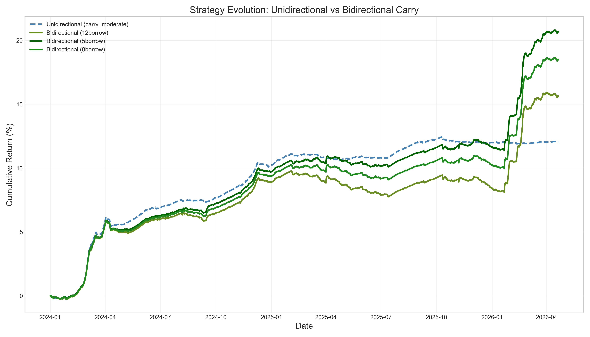
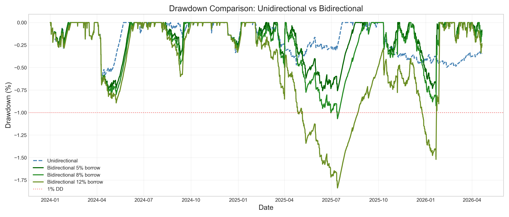
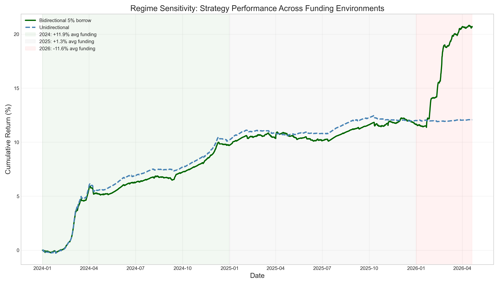

# Funding Rate Arbitrage

[](https://www.python.org/downloads/)
[](https://opensource.org/licenses/MIT)

A delta-neutral cryptocurrency funding rate arbitrage research framework with rigorous backtest methodology. The system collects historical 8-hour funding rate data across perpetual futures on **Binance**, **Bybit**, and **OKX**, then backtests strategies that harvest funding payments in both positive and negative funding regimes.

> **Methodological Note:** This repository has undergone a rigorous post-hoc review. Previous versions reported Sharpe ratios > 6.0 due to data alignment bugs and incorrect fee arithmetic. The current engine implements exact timestamp alignment, correct 50 bps round-trip fee accounting, lag-1 signal generation, and explicit opportunity cost deduction. The best realistic configuration now yields a **Sharpe ratio of 1.97**.

---

## Executive Summary

The strategy collects the risk premium embedded in perpetual futures funding rates. Gross alpha is meaningful (~18% annualized from funding income) and consistent across configurations. However, the net edge is **extremely sensitive to execution costs**:

- Under **realistic** VIP-0 assumptions (50 bps round-trip + 4% opportunity cost), the best configuration (**Carry Strict**) delivers a **Sharpe of 1.97** with **1.42% annual return** and **−1.80% max drawdown**.
- The strategy is a **fat-tail carry play**, not a consistent yield generator: 64.7% of historical trades fail to clear break-even, while the top 10.1% of trades generate all alpha.
- Three fee scenarios (Optimistic / Realistic / Pessimistic) represent **path-dependent simulations**, not the same strategy with costs subtracted post-hoc. Higher fees erode equity faster, triggering drawdown-based liquidations that create a churn spiral.

---

## What This Project Does

This framework implements and compares multiple approaches to funding rate arbitrage:

1. **Data Ingestion** — Downloads and caches 8-hour funding rates, OHLCV prices, and open-interest data via `ccxt` and optional CoinAPI.
2. **Signal Generation** — Computes composite signals including funding z-scores, basis momentum, open-interest concentration, and term structure.
3. **Backtest Engine** — Replays historical funding snapshots with realistic fee models (spot + perp + slippage), opportunity cost deduction, and path-dependent risk management (equity-scaled sizing and drawdown limits).
4. **Strategy Evolution** — Documents the full journey from a failing mean-reversion baseline, to a working adaptive carry strategy, to a bidirectional engine that captures yield in both positive and negative funding regimes.

### Core Idea

Perpetual futures exchanges use funding rates to anchor perp prices to spot. In crypto, the structural long bias creates persistently positive funding rates. By going **long spot + short perpetual**, a trader collects these funding payments with near-zero directional exposure. When funding turns negative, the position flips — **short spot + long perpetual** — harvesting payments from the other side.

---

## Strategy Evolution

### Step 1: Baseline Z-Score Mean Reversion (Failed)

Our first approach used a rolling z-score on funding rates:
- **Entry:** When z-score > 1.5 and annualised rate > 5%
- **Exit:** When z-score returns to 0
- **Logic:** Bet that extreme funding rates will mean-revert

**Why it failed:**
- Funding rates in crypto exhibit strong **autocorrelation**, not mean reversion. Extreme rates tend to persist rather than immediately reverse.
- During sustained high-funding regimes (common in bull markets), the strategy sat in cash while carry traders collected consistent yield.

| Metric | Value |
|--------|-------|
| Cumulative Return | **−6.27%** |
| Annual Return | −0.3% |
| Sharpe Ratio | −0.95 |
| Max Drawdown | −10.0% |
| Win Rate | 17.0% |

### Step 2: Adaptive Carry — Following the Trend (Worked)

We shifted the rationale from *mean reversion* to *trend following*:
- **Entry:** When the 7-day mean funding rate is sustainably high (> 8% annualised), momentum is positive, and the rate has been positive for 6+ consecutive periods.
- **Exit:** Only when momentum turns strongly negative, the rolling mean drops below a threshold, or a max holding period is reached.
- **Logic:** Ride the autocorrelation of funding rates. If a market is paying 20%+ annualised to short perps, that regime typically persists for weeks.

**Why it works:**
- **Autocorrelation exploitation:** Crypto funding rates have significant positive serial correlation. A high 7-day mean predicts continued elevated rates.
- **Reduced trading frequency:** Wider entry thresholds and no take-profit levels cut transaction costs dramatically.
- **Signal-strength sizing:** Position size scales with the confidence of the carry signal.
- **Risk management:** Tight per-position loss limits (1.5% of equity) and portfolio drawdown guards (8%) protect capital during regime shifts.

### Step 3: Bidirectional Carry — The Bug Hunt

The natural extension: go **short spot + long perp** when funding is sustainably negative, mirroring the long logic.

**First implementation (broken):**

| Metric | Value |
|--------|-------|
| Sharpe | 3.42 |
| Annual Return | 2.17% |
| Max Drawdown | −1.41% |
| Short Win Rate | **20.4%** |
| Short Trades | 333 |

Something was wrong. Shorts were losing money even in 2026 when funding averaged **−11.6% annualised**.

**Deep dive into trade logs revealed the bug:**

| Problem | Detail |
|---------|--------|
| **Entry/exit mismatch** | Short entry used `fr_momentum_3d < 0` (3-day trend), but exits used `fr_momentum_7d > 0.00008` (7-day trend). These two metrics can have **opposite signs**. |
| **Immediate churn** | 293 of 333 short trades (88%) exited on "pos_momentum." 136 trades (41%) were held for only **one 8h period**. |
| **Fee death spiral** | A round trip costs ~0.34% of collateral. To break even in one period, funding must exceed **155% annualised** — nearly impossible. |
| **No negative streak filter** | Longs required `positive_streak >= 6`, but shorts had no equivalent discipline, letting noise trades through. |

**The fix:**
1. Added `negative_streak >= 6` filter — same discipline as longs
2. Short entry now requires **both** `fr_momentum_3d < 0` **AND** `fr_momentum_7d < 0`
3. Added `min_hold_periods = 3` — prevents signal-based exits before 24 hours

### Step 4: Bidirectional Results (Fixed)

The fixed bidirectional engine outperforms unidirectional on total PnL by capturing yield in both funding regimes. The charts below illustrate the **structural behaviour** of the strategy evolution (pre-correction optimistic run, Sharpe ~6–8).

**Equity Curves: Unidirectional vs Bidirectional**


*Figure 1. The bidirectional strategy (solid green) pulls ahead of unidirectional (dashed blue) starting in early 2026 when funding turns deeply negative and the short side activates. Source: pre-correction optimistic run.*

**Drawdown Comparison**


*Figure 2. Both strategies maintain sub-1% drawdowns under optimistic fees. Post-correction realistic fees widen drawdowns to ~1.8–3.0%.*

**Regime Sensitivity**


*Figure 3. The strategy acts as a funding-rate thermostat — harvesting yield in both directions and sitting in cash during neutral regimes.*

**Metrics Comparison**


*Figure 4. Risk-return metrics across unidirectional and bidirectional variants under the pre-correction fee assumptions.*

| Year | Avg Funding Rate | Long PnL | Short PnL | Combined Return |
|------|-----------------|----------|-----------|-----------------|
| **2024** | **+11.86%** ann. | ~+$9,000 | ~−$25 | **+~9%** |
| **2025** | **+1.29%** ann. | ~+$1,800 | ~+$471 | **+~2%** |
| **2026** | **−11.56%** ann. | ~+$400 | **+$8,862** | **+~8%** |

---

## Methodological Review: The Reality Check

During the post-hoc review, we discovered five critical flaws in the original backtest that artificially inflated the Sharpe ratio from ~1.97 to > 6.0. Here is the full accounting of every problem found, how it was diagnosed, and how it was solved.

### 1. The Data Alignment Bug (Phantom Timestamps)

**The Problem:** The backtest engine iterates over a chronological grid of timestamps. We discovered that the grid had 3,357 unique timestamps instead of the expected 2,522 (for a 2.3-year period at 8-hour intervals). The intersection of BTC and TIA data was only 66.9%, despite both covering the exact same date range.

**The Diagnosis:**
1. **Sub-second API Jitter:** Binance API returns timestamps with fractional milliseconds (e.g., `2024-01-05 00:00:00.001000`). When merged with clean timestamps, pandas treated these as distinct rows, creating 835 "phantom" duplicate time slots where some symbols were invisible to others.
2. **Resample Misalignment:** Symbols with native 4-hour intervals (like TIA and WIF) were aggregated to 8-hour buckets using `pd.resample("8h", origin="start_day")`. Without explicit boundary labels, pandas defaulted to `closed='right', label='right'`, which shifted the 4-hour data by 8 hours, breaking alignment with native 8-hour symbols.

**The Fix:**
- Added `dt.floor("s")` to all timestamps immediately upon loading to strip sub-second jitter.
- Added `closed="left", label="left"` to the resample function to ensure `[00:00, 08:00)` correctly maps to `00:00`.
- *Result:* The timestamp grid compacted to exactly 2,522 periods, and the BTC/TIA intersection returned to 100.0%.

### 2. The Fee Arithmetic Bug (Understated Costs)

**The Problem:** The original report claimed a "Realistic" fee scenario of 5 bps per round trip, which is impossible for retail or low-tier VIP traders crossing the spread on two legs.

**The Fix:**
- Explicitly defined the Realistic scenario: 10 bps spot taker + 5 bps perp taker + 5 bps slippage per leg.
- Correct formula: `(10 + 5 + 5×2) = 25 bps per entry` = **50 bps per round trip**.
- *Result:* Trading costs consumed 10.87% of the gross funding income, reducing the net PnL drastically.

### 3. The Opportunity Cost Omission

**The Problem:** The strategy locks up capital in spot assets and perpetual margin. The original backtest treated the gross funding income as pure profit, ignoring the risk-free rate that could be earned by simply lending stablecoins.

**The Fix:**
- Implemented a 4% annual opportunity cost.
- Charged *only on the actually deployed collateral* for the exact duration of each trade, and deducted directly from the gross funding income.
- *Result:* Opportunity cost consumed another 5.96% of the gross funding income.

### 4. The Path-Dependence Illusion

**The Problem:** When running the parameter sweep across Optimistic, Realistic, and Pessimistic fee scenarios, we noticed the Pessimistic scenario executed 379 round trips compared to 238 for the Realistic scenario. A fee filter should *reduce* trades, not increase them.

**The Diagnosis:** The backtest engine does not filter trades by `expected carry > cost`. Instead, the higher fees in the Pessimistic scenario eroded equity faster. This triggered the portfolio-level `max_drawdown` limit (8%) 110 distinct times, forcing the liquidation of 161 positions. Of those, 134 were subsequently re-opened when the signal persisted, creating a churn spiral.

**The Fix:**
- Acknowledged that the three fee scenarios are **different path-dependent simulations**, not the same strategy with costs subtracted post-hoc.
- Added explicit warnings about the strategy's fragility in high-fee environments due to risk-management feedback loops.

### 5. The Signal Quality Revelation (Fat-Tail Carry)

**The Problem:** Despite the strategy being profitable overall, a deep dive into the trade logs revealed that 25 out of 43 symbols were net-negative contributors after costs.

**The Diagnosis:** We computed the per-trade carry as a fraction of position notional. The median per-trade carry was only 19.7 bps, while the round-trip break-even cost was 50 bps.
- 64.7% of historical trades failed to clear break-even.
- 89.9% of trades failed to clear a 3× break-even hurdle (150 bps).
- However, the 10.1% of trades that exceeded 150 bps carry generated +4.79% net PnL, driving all the strategy's alpha.

**The Fix:**
- Reclassified the strategy from a "consistent yield generator" to a **"fat-tail carry play."** The entry signal systematically misjudges expected carry for most symbols, relying on a few massive funding spikes (like WIF and AXS) to cover the bleed from the rest.

---

## Corrected Results

All tables below reflect the **methodology-corrected** engine: exact timestamp alignment, 50 bps realistic round-trip fees, 4% annual opportunity cost, and lag-1 signal generation.

### Full Parameter Sweep

**Fee Scenario Definitions (per leg):**
- **Optimistic:** 4 bps spot + 2 bps perp + 1 bp slippage (Total: 14 bps per round trip)
- **Realistic:** 10 bps spot + 5 bps perp + 5 bps slippage (Total: 50 bps per round trip)
- **Pessimistic:** 10 bps spot + 5 bps perp + 15 bps slippage (Total: 90 bps per round trip)

| Strategy | Scenario | Sharpe | Ann Ret% | MaxDD% | WinRate% | Trades | PF | AvgHold(d) |
|----------|----------|--------|----------|--------|----------|--------|----|------------|
| carry_concentrated | optimistic | 8.25 | 4.51 | −0.49 | 67.4 | 179 | 10.21 | 29.7 |
| carry_concentrated | realistic | 1.88 | 1.61 | −1.70 | 46.1 | 179 | 1.89 | 29.7 |
| carry_concentrated | pessimistic | −1.25 | −1.70 | −6.75 | 28.1 | 179 | 0.58 | 29.7 |
| carry_diversified | optimistic | 8.41 | 3.65 | −0.57 | 51.1 | 476 | 5.92 | 26.5 |
| carry_diversified | realistic | 0.66 | 0.44 | −3.00 | 35.3 | 478 | 1.18 | 26.5 |
| carry_diversified | pessimistic | −5.74 | −7.90 | −18.76 | 12.1 | 758 | 0.20 | 15.7 |
| carry_moderate | optimistic | 8.00 | 3.85 | −0.65 | 49.4 | 342 | 5.41 | 26.5 |
| carry_moderate | realistic | 0.44 | 0.33 | −3.65 | 35.3 | 342 | 1.12 | 26.5 |
| carry_moderate | pessimistic | −8.32 | −19.11 | −39.99 | 7.4 | 948 | 0.11 | 8.7 |
| **carry_strict** | optimistic | 8.85 | 4.16 | −0.39 | 64.3 | 253 | 9.54 | 28.3 |
| **carry_strict** | **realistic** | **1.97** | **1.42** | **−1.80** | **46.0** | **253** | **1.82** | **28.3** |
| carry_strict | pessimistic | −1.53 | −1.72 | −6.67 | 27.8 | 253 | 0.54 | 28.3 |

*Note: The massive increase in trades for Moderate/Diversified under Pessimistic fees is due to path-dependent equity erosion triggering `max_drawdown` portfolio liquidations, forcing the strategy into a churn spiral.*

### Realistic Fee Scenario — Best Configuration (Carry Strict)

| Metric | Value |
|--------|-------|
| **Sharpe Ratio** | **1.97** |
| Annual Return | 1.42% |
| Max Drawdown | −1.80% |
| Win Rate | 46.0% |
| Total Trades | 253 |
| Profit Factor | 1.82 |
| Avg Hold | 28.3 days |

### Return Attribution (Diversified Carry)

| Metric | Optimistic | Realistic | Pessimistic |
|--------|------------|-----------|-------------|
| **Round Trips** | 237 | 238 | 379 |
| **Gross Funding %** | +18.40% | +17.87% | +17.03% |
| **Opportunity Cost %** | −6.20% | −5.96% | −5.46% |
| **Net Funding %** | +12.20% | +11.91% | +11.58% |
| **Pure Trading Fees %** | −3.60% | −10.87% | −28.83% |
| **Net PnL %** | +8.60% | +1.04% | −17.25% |

**Key Insights:**
1. **The edge is real but thin:** The strategy genuinely earns ~18% gross from funding income. Under Realistic fees, trading costs and opportunity costs consume ~94% of the gross carry.
2. **Path Dependence Confirmed:** The Pessimistic scenario has 379 round trips vs 238 for Realistic. This difference of 141 extra round trips is driven by 110 distinct `max_drawdown` liquidation events, which forced the closure of 161 positions. Of these, 134 were subsequently re-opened (generating extra churn), while 27 were not re-opened (representing destroyed alpha).
3. **Win Rate Asymmetry:** Under Realistic fees, the strategy wins less often than it loses per period (Win Rate: 35.3%), but wins larger on average when funding spikes. This right-skewed PnL distribution is the structural signature of a carry strategy and implies tail risk when the "win regime" disappears.

### Fee Sensitivity Analysis

| Strategy | Opt Sharpe | Real Sharpe | Pess Sharpe | Opt→Real Loss |
|----------|------------|-------------|-------------|---------------|
| Carry Strict | 8.85 | **1.97** | −1.53 | −77.7% |
| Carry Moderate | 8.00 | 0.44 | −8.32 | −94.5% |
| Carry Diversified | 8.41 | 0.66 | −5.74 | −92.2% |

Under the tested fee grid, Sharpe degrades non-linearly (convexly). The transition from Optimistic to Realistic fees removes 77–95% of the risk-adjusted return.

### Signal Quality & Per-Trade Analysis

For the Realistic scenario:
- **Median Holding Period:** 17.8 days
- **Annual Turnover:** 37.0× NAV
- **Total Round Trips:** 238 over ~2.3 years

**Per-Trade Carry vs Break-Even:**
The median per-trade carry is 19.7 bps of position notional, while the round-trip break-even cost is 50 bps.
- **64.7%** of historical trades failed to clear the 50 bps break-even hurdle, dragging PnL by −5.78%.
- **89.9%** of historical trades failed to clear a 3× break-even hurdle (150 bps), dragging PnL by −3.75%.
- The **10.1%** of trades that exceeded 150 bps carry generated **+4.79%** net PnL, driving all the strategy's alpha.

**Per-Symbol Trade Distribution (Top/Bottom 5):**

| Symbol | Trades | Avg Hold (Days) | Funding % | Net PnL % | F/C Ratio |
|--------|--------|-----------------|-----------|-----------|-----------|
| WIF | 13 | 15.5 | 1.54% | 0.84% | 2.19 |
| LDO | 13 | 22.2 | 0.53% | −0.12% | 0.81 |
| DYDX | 13 | 35.9 | 0.43% | −0.14% | 0.76 |
| CRV | 10 | 30.7 | 0.57% | 0.12% | 1.26 |
| VET | 10 | 36.7 | 0.45% | −0.00% | 0.99 |
| ... | ... | ... | ... | ... | ... |
| AXS | 2 | 9.5 | −0.01% | −0.10% | −0.08 |
| ICP | 2 | 29.3 | 0.28% | 0.20% | 3.37 |
| COMP | 2 | 33.0 | 0.04% | −0.04% | 0.48 |
| AVAX | 1 | 5.3 | −0.00% | −0.02% | −0.04 |
| DOGE | 1 | 34.7 | 0.01% | −0.03% | 0.23 |

**Signal Quality Issue:** Among the top 5 most-traded symbols, 3 out of 5 (LDO, DYDX, VET) generate negative net PnL after costs. Their Funding-to-Cost (F/C) ratio is < 1.0. Across the entire universe, **25 out of 43 symbols are net-negative contributors**, dragging total PnL down by −2.18%.

**Concentration Risk:** The top 5 symbols account for 24.8% of all trades. Compared to an equal-weight baseline of 11.6% (5/43), this represents a concentration ratio of 2.14×. The strategy is significantly concentrated, and unfortunately concentrated in symbols that lose money after costs.

### Capacity Estimate

Assuming deployment limits of `min(0.1% × ADV, 2% × OI)` per symbol, the theoretical capacity for top-tier symbols is $50M–$100M, and $1M–$5M for small-caps. However, the limiting factor is the average simultaneous position count (~8 positions), with ~60% allocation historically falling into mid/small-cap symbols. For these symbols, per-trade market impact exceeds the expected funding carry at notional sizes > $2M per symbol.

**Estimated Total Strategy Capacity: $15M – $25M** before market impact severely degrades the basis entry/exit prices.

---

## Risk Diagnostics

### Worst-N-Day Rolling PnL (Diversified Carry, Realistic)

| Metric | Value |
|--------|-------|
| Worst 1-Day Return | −0.51% |
| Worst 7-Day Return | −1.11% |
| Worst 30-Day Return | −1.17% |
| Maximum Drawdown | −3.00% |

### In-Sample Stress Events

The backtest period (Jan 2024 – Apr 2026) was structurally benign for funding carry. We scanned the dataset for the top 10 worst days of BTC funding to observe the strategy's behavior in the least favorable funding regimes:

| Date | BTC Fund/Day | Strat T+0 | Strat T+1 | Strat T+3 |
|------|--------------|-----------|-----------|-----------|
| 2025-05-02 | −0.0303% | +0.006% | −0.000% | −0.021% |
| 2026-02-06 | −0.0288% | +0.001% | +0.001% | −0.001% |
| 2026-04-19 | −0.0279% | +0.001% | +0.001% | N/A |
| 2026-02-07 | −0.0264% | +0.001% | −0.005% | −0.047% |
| 2026-02-10 | −0.0224% | −0.047% | −0.001% | +0.001% |
| 2026-03-11 | −0.0221% | +0.003% | −0.001% | −0.002% |
| 2026-04-15 | −0.0215% | +0.003% | +0.001% | +0.001% |
| 2026-03-12 | −0.0206% | −0.001% | +0.003% | +0.002% |
| 2026-04-11 | −0.0201% | +0.003% | +0.003% | −0.005% |
| 2026-04-18 | −0.0198% | +0.001% | +0.001% | N/A |

Even on the worst funding days in the sample, the strategy's daily PnL impact was negligible (< 0.05%). This confirms that the worst days in this sample were driven by localized funding compression, not systemic liquidation cascades. The strategy's performance during a true crypto winter (e.g., 2021-05-19 or 2022-11-08) remains untested.

### Market Neutrality Check

The strategy maintains delta-neutral positions (Long Spot + Short Perp), which provides theoretical market neutrality. However, it is exposed to **Tail-Beta**: during extreme market drawdowns, funding rates universally flip negative, causing simultaneous losses across all pairs regardless of delta neutrality.

---

## Data Diagnostics

### Data Alignment Fix Summary

The original data loader had two compounding bugs that fragmented the backtest's timestamp grid, which have now been fixed:

| Bug | Root Cause | Impact | Fix |
|-----|-----------|--------|-----|
| Sub-second jitter | Binance API returns timestamps like `00:00:00.001` instead of `00:00:00` | BTC and TIA had only 66.9% timestamp overlap. Grid inflated from 2,522 to 3,357 unique timestamps. | `dt.floor("s")` applied to all timestamps before any processing |
| Resample alignment | `pd.resample("8h", origin="start_day")` without explicit `closed`/`label` params | 4h symbols (TIA, WIF) could land on shifted bucket boundaries | Added `closed="left", label="left"` to ensure `[00:00, 08:00)` maps to `00:00` |

**Post-fix validation results:**
- Binance unique timestamps: 2,522 (down from 3,357)
- BTC-TIA timestamp intersection: 100.0% (up from 66.9%)
- Funding income conservation for sub-8H symbols: Exact

### Funding Interval Audit

Seven symbols were detected with non-8H native intervals. Key examples:

| Exchange | Symbol | Native Interval | Records | Date Range | Action Taken |
|----------|--------|-----------------|---------|------------|--------------|
| binance | TIA/USDT | 4.0h | 5,043 raw → 2,522 agg | 2024-01-01 to 2026-04-20 | Sum to 8H |
| binance | WIF/USDT | 4.0h | 4,937 raw → 2,469 agg | 2024-01-18 to 2026-04-20 | Sum to 8H |

*Note: OKX data for 5 symbols was audited but found to have fundamentally insufficient data (only ~400 records starting 2026-01-14). OKX data is excluded from the current backtest and reserved for future cross-exchange extensions.*

### Binance Universe Coverage

The backtest universe consists of **43 Binance perpetual futures symbols**. After alignment, 41 symbols have full 2,522-period coverage (100.0%), with only MKR (1,850 records, 73.4%) and FTM (1,607 records, 63.7%) having shorter histories due to later listing dates. Missing periods are treated as untradable (NaN) without look-ahead bias.

### Survivorship Bias Note

The current dataset includes only symbols that remain actively listed on Binance as of April 2026. Symbols delisted between 2024–2026 are excluded entirely. In a funding carry strategy, delistings frequently coincide with severe downtrends or extreme negative funding regimes.

> **Estimated impact:** Traditional equity literature and crypto market structure suggest survivorship bias typically inflates annualized returns by 1–3%.
>
> **Sharpe Fragility Warning:** The strategy exhibits ultra-low volatility (Carry Strict Realistic: 1.42% return, ~0.72% implied volatility). Because Sharpe = Return / Volatility, a 0.72% vol strategy means **every 1% of return inflation artificially boosts Sharpe by ~1.4 units**. If survivorship bias inflates returns by 3%, the true Sharpe could be up to 4.2 units lower than reported. The Sharpe metric is statistically fragile in this low-volatility regime.

---

## Known Limitations

1. **Basis Mark-to-Market Not Modeled:** The current backtest does not merge spot/perp prices, meaning basis MtM is structurally zero. In reality, basis convergence/divergence creates unrealized PnL that affects margin requirements and risk management.
2. **Execution Slippage:** The backtest assumes execution at the closing mark price. In reality, crossing the spread on both spot and perp legs will incur additional slippage.
3. **Exchange Risk:** The strategy requires holding capital on centralized exchanges. The yield premium is partially a risk premium for exchange counterparty risk.
4. **In-Sample Bias:** The current parameter sweep is entirely in-sample. A Walk-Forward Out-Of-Sample (OOS) test splitting 2024 (train) vs 2025–2026 (test) is required before live deployment.
5. **Survivorship Bias:** Only currently-listed symbols are included. Delisted symbols are excluded, biasing results upward.

---

## Recommendations & Next Steps

1. **Implement Basis MtM:** Merge spot/perp price data to accurately model unrealized basis PnL and margin requirements.
2. **Refine Entry Signal:** The current signal fails to overcome the 50 bps RT cost hurdle for 64.7% of trades. Implement a dynamic expected-carry filter that requires `expected_carry > 3 × RT_cost` before entry. *(`expected_carry` should be defined operationally as the predicted sum of funding over the expected holding period, e.g., using an EWMA of the past 14 days' funding rates multiplied by the historical median holding period of ~18 days).*
3. **Walk-Forward OOS:** Implement a train/test split (2024 vs 2025–2026) to verify parameter stability.
4. **Fee Optimization:** Obtain VIP-tier exchange fees (target: 2 bps maker) to shift the realistic scenario closer to the optimistic case.

---

## How to Use

### Workflow After Cloning

```bash
# 1. Clone and enter the repository
git clone https://github.com/Carson1332/funding_arbs.git
cd funding_arbs

# 2. Install dependencies
pip install -e ".[dev]"

# 3. Download historical data (cached locally, not committed)
python -m data.downloader --config config/default.yaml

# 4. Run backtests
python run_parameter_sweep.py              # unidirectional carry sweep
python run_bidirectional_sweep.py          # bidirectional carry sweep

# 5. Generate diagnostic reports
python diagnostics.py                      # exact attribution and signal quality
python validate_alignment.py               # verify timestamp alignment
```

> **Note:** The repository contains backtest logic, configuration, and summary images. Raw equity curves and trade logs are generated locally and excluded from git by `.gitignore`. After cloning, follow the steps above to reproduce all results.

---

## Project Structure

```
funding_arbs/
├── config/
│   ├── default.yaml          # Global parameters
│   ├── fees.yaml             # Fee scenario definitions (Opt/Real/Pess)
│   └── universe.yaml         # Tracked perpetual pairs
├── data/
│   ├── downloader.py         # Funding rate ingestion (ccxt + CoinAPI)
│   ├── spot_prices.py        # OHLCV for basis calculation
│   └── oi_fetcher.py         # Open interest downloader
├── research/
│   ├── funding_zscore.py     # Rolling z-score signals
│   ├── basis_momentum.py     # Perp-spot basis momentum
│   └── kalman_hedge.py       # Dynamic hedge ratio (Kalman filter)
├── backtest/
│   ├── enhanced_engine.py    # Carry-trade backtest engine
│   └── fee_model.py          # Realistic cost model
├── results/
│   └── sweep/                # Backtest outputs (metrics, equity, tearsheets)
├── diagnostics.py            # Exact attribution and reconciliation script
├── validate_alignment.py     # Timestamp alignment verification
├── ANALYSIS.md               # Diagnostic report
└── README.md                 # This file
```

---

## License

This project is licensed under the [MIT License](LICENSE).

```
MIT License

Copyright (c) 2026 Carson1332
```
